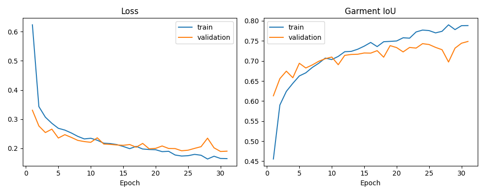
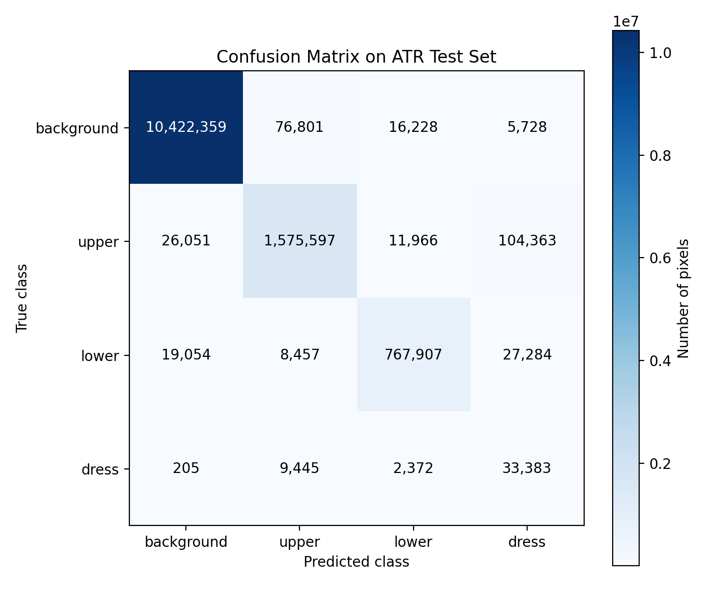
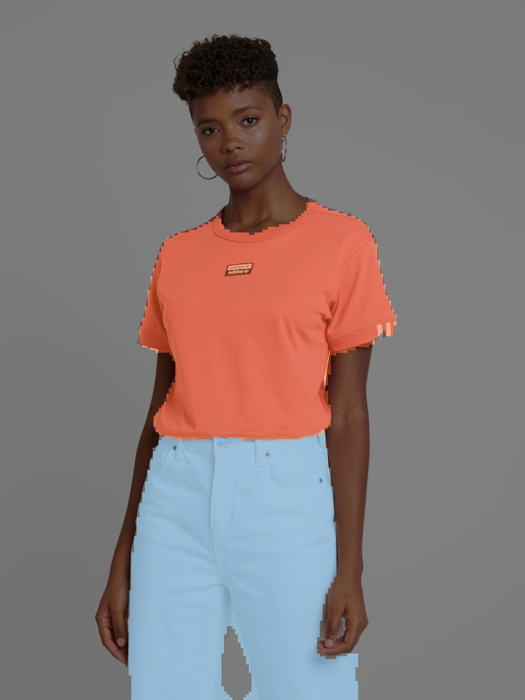
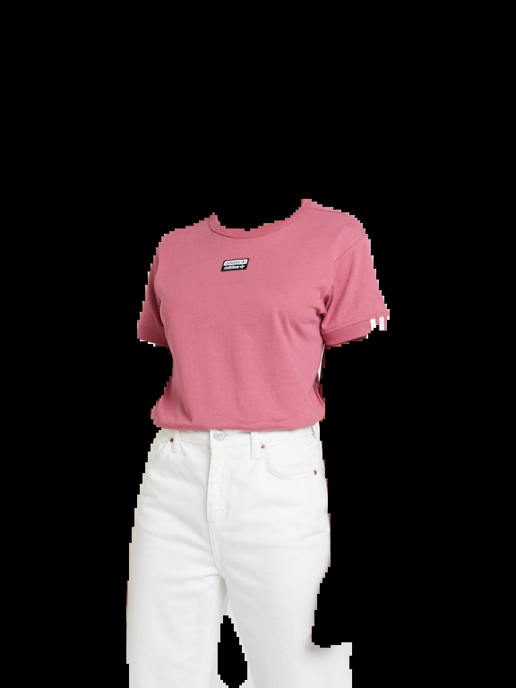
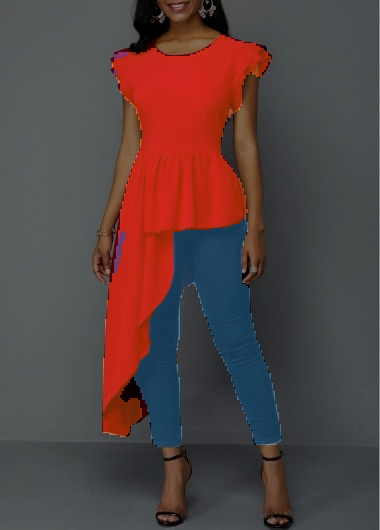
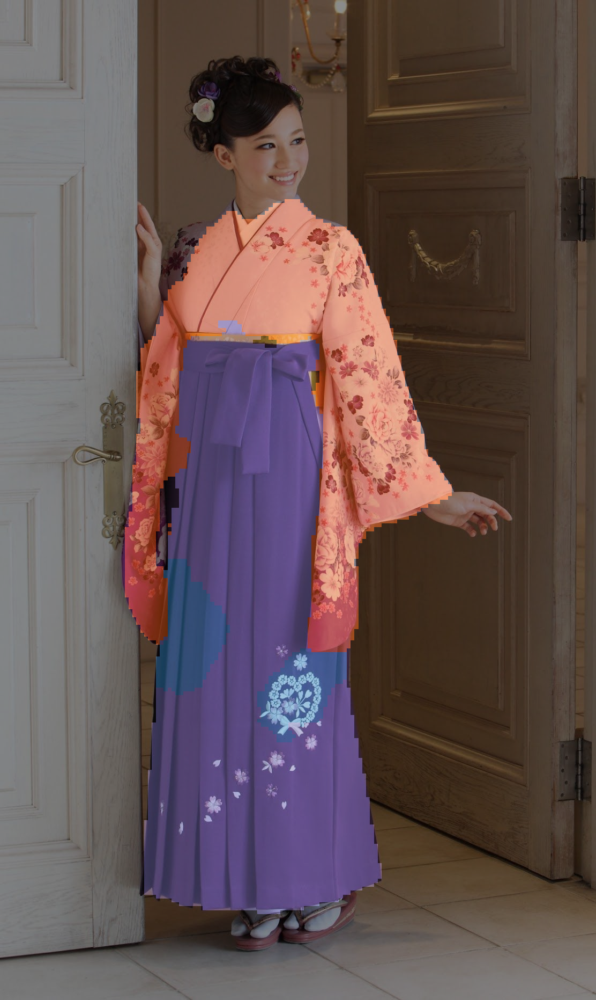
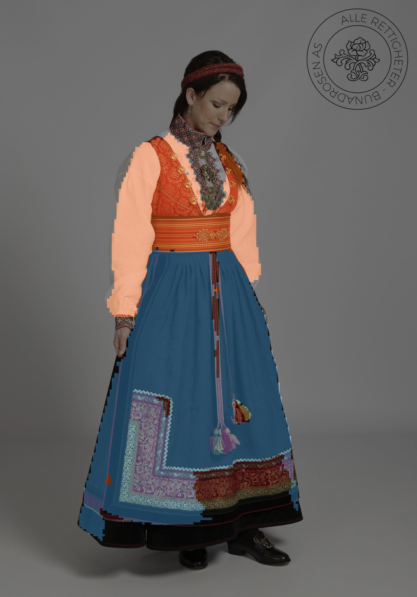
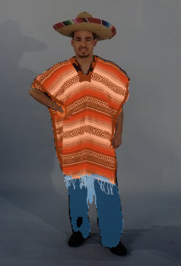
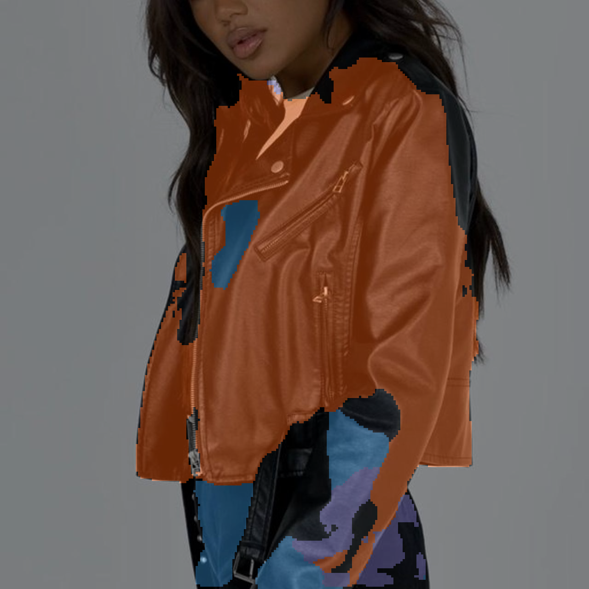
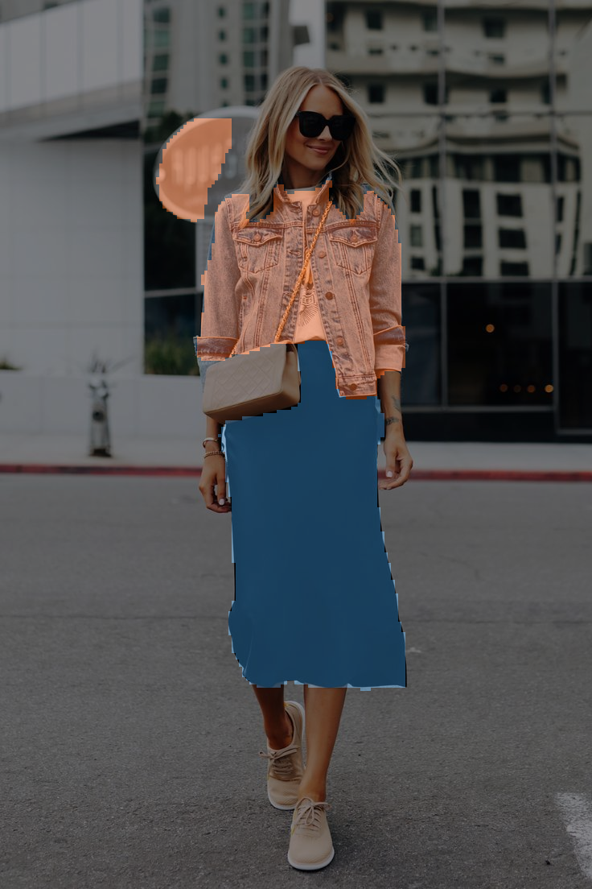

# Clothes Segmentation — Report

Segmenting clothes in photos of people. Every pixel gets one of four labels:

| id | class | covers |
|---|---|---|
| 0 | `background` | background, skin, hair, accessories |
| 1 | `upper` | shirts, tops, jackets |
| 2 | `lower` | pants and skirts |
| 3 | `dress` | one-piece dresses |

---

## 1. Dataset choice

**ATR human parsing**, via the [Hugging Face](https://huggingface.co/datasets/ckotait/ATRDataset) —
17906 photos of people with pixel-level masks over 18 labels.

Why ATR:

- **It has people in it.** Fashion catalogue datasets are mostly product shots with no person.
- **It is pixel labelled, not boxed.** 
- **Its images match the target input** — one person, mostly full body, facing the camera.
- **17k images** is enough to fine-tune a pretrained encoder and small enough for one GPU.

### Why four classes

The 18 labels are regrouped in `label_map`:

| our class | ATR labels |
|---|---|
| `upper` | 4 upperclothes |
| `lower` | 5 skirt, 6 pants |
| `dress` | 7 dress |
| `background` | everything else — skin, hair, face, hat, belt, shoes, scarf, bag |

- **Every core garment label is kept.** Skirt and pants merge only because they cover the
  same body region and get replaced the same way.
- **Dress stays separate from upper**, because merging them would teach the model that one
  class sometimes stops at the waist and sometimes reaches the ankles.
- **Shoes, hats and bags are out of scope** — not a try-on garment slot.
- **Belts, scarves and sunglasses are too small to learn** at this dataset size.

---

## 2. Preprocessing and augmentation

Images and masks are resized so the **long side** is 256, then padded to a square. A plain
resize to 256×256 would squash the aspect ratio and distort body proportions. The padding is
undone at inference by `remove_padding`.

Normalisation uses ImageNet statistics, since the encoder starts from ImageNet weights.

Training only:

| Augmentation | Reason |
|---|---|
| `HorizontalFlip` p=0.5 | people face either way |
| `ShiftScaleRotate` ±10° / ±10% | the person is not always centred or at the same distance |
| `RandomBrightnessContrast` p=0.3 | photos vary a lot in lighting |

Geometric transforms are applied to image and mask together; the colour transform touches
the image only.

**Splits.** ATR ships its own three splits, used unchanged: **16706 train, 1000 validation,
200 test**. 


## 3. Model architecture

**U-Net with a ResNet34 encoder, initialised from ImageNet.** Four logits per pixel, the
prediction is the argmax.

- **U-Net** — the skip connections carry high-resolution detail to the decoder. Collars,
  cuffs and hemlines are the thin structures otherwise lost in downsampling.
- **ResNet34** — deep enough to tell a long shirt from a short dress, small enough
  (~24M parameters) to train in about an hour.
- **ImageNet pretrained** — at 17k images, training the encoder from scratch converges
  slower and plateaus lower.


| Setting | Value |
|---|---|
| input | 256×256 |
| batch size | 16 |
| epochs | 40 |
| optimizer | AdamW, lr 1e-4 constant, wd 1e-4 |

---

## 4. Loss function

**CrossEntropy + multiclass Dice, summed.** Neither works alone:

- > Cross entropy helps the model learn the class of each pixel. Dice helps it match the clothing area better. I used both because clothes, especially dresses, take fewer pixels than the background. Dresses are still the hardest class because they are less common and can look similar to upper clothes.

---

## 5. Evaluation metrics

- **IoU per class**, and the **mean over the three garment classes** as the headline.
  Background is excluded because it covers most of the image and is easy, so including it
  would inflate the score.
- **Dice per class**, the standard companion to IoU.
- **Pixel accuracy**, as secondary context only.

All from `torchmetrics`. They are stateful: `update()` accumulates counts per batch and
`compute()` divides once at the end over the whole split, which is what makes the ratio
correct.

The best checkpoint is selected on **validation garment IoU**, not loss.

---

## 6. Results

Best epoch **31** of 40. Evaluated once on 200-image test split.

### Test scores

| Class | IoU | Dice |
|---|---:|---:|
| background | 0.9864 | 0.9931 |
| upper | 0.8692 | 0.9300 |
| lower | 0.9000 | 0.9473 |
| dress | **0.1826** | **0.3089** |
| **garment mean** | **0.6506** | **0.7287** |

Pixel accuracy: 0.9765

`upper` at 0.87 and `lower` at 0.90 are solid. **`dress` collapses to 0.18** and drags the
garment mean down to 0.65.

Pixel accuracy is 0.9765 on a model that cannot do one of its three classes — which is
exactly why the headline metric excludes background.

### Training curves



Validation tracks training without a widening gap, so the model is not overfitting. 
### Confusion matrix



Row-normalised (rows = true, columns = predicted):

| true \ pred | background | upper | lower | dress |
|---|---:|---:|---:|---:|
| **background** | **99.06%** | 0.73% | 0.15% | 0.05% |
| **upper** | 1.52% | **91.71%** | 0.70% | 6.07% |
| **lower** | 2.32% | 1.03% | **93.34%** | 3.32% |
| **dress** | 0.45% | 20.80% | 5.22% | **73.52%** |

### Why `dress` scores 0.18

Not for the obvious reason. **Recall is 73.5%** — the model finds most dress pixels. The
failure is **precision, at 19.5%**:

- 104,363 `upper` pixels are predicted as `dress`
- only 45,405 true `dress` pixels exist in the whole test split
- so **61% of what the model calls a dress is actually an upper garment**

The model is **over-predicting** dresses, labelling long tops and tunics as dresses. IoU
punishes that hard, because false positives count in the denominator.

The cause is imbalance: true `dress` is **0.35% of test pixels** against 13% for `upper`.
Dice keeps the class learnable but cannot invent a boundary the training data barely shows.

### Clean cases

Test split. Tight boundaries at the collar, sleeve hem and waistline:

| overlay | clothes only |
|---|---|
|  |  |

Outside the dataset — an asymmetric top over jeans, correctly split at the waist:



### Traditional and non-Western clothing

**This is the weakest area.** ATR is mostly modern Western streetwear, so garments
outside that are segmented poorly.

**Japanese kimono with skirk** — the wide hanging sleeve on the left is dropped to
background, and the skirt is split between `lower` (blue) and `dress` (purple) across
one garment:



**Norwegian bunad** — the blouse and bodice become `upper` and the apron becomes `lower`,
but the black skirt underneath is missed entirely:



**Mexican poncho** — the poncho is caught, but the trousers come out fragmented and full of
holes:



The common thread: **traditional dress is loose, layered, and does not divide at the waist**
the way Western clothing does. The four-class output assumes an upper/lower split or a
single dress, and garments that fit neither get carved arbitrarily between them.

### Other failure modes

**Cropped close-up** — the jacket is full of holes, a `lower` (blue) blob appears on the
chest, and the bottom of the frame mixes all three classes:



**False positive on background** — an orange `upper` blob on a building to the left of her
hair, with no person there:



---

## 7. System capabilities

### a. Strengths

- **Contemporary Western clothing works reliably** — `upper` 0.87 and `lower` 0.90 IoU,
  covering most real inputs.
- **Boundaries are clean** 
- **The upper/lower split is dependable** — so one garment can be replaced without touching the other.
- **Patterned and textured fabrics work** — denim, prints and solids all segment well.
- **It generalises past ATR.** The out-of-dataset photos above are studio and street shots
  the model never saw.
- **Output is at the original input resolution**, so the mask composites straight back.

### b. Drawbacks and wrong segmentation

- **`dress` is unusable at 0.18 IoU.** 
- **Upper→dress is the dominant error** at 6.07%. Because `upper` is 36× larger than
  `dress`.
- **Traditional and non-Western clothing fails** — dropped sleeves, one garment split across
  two classes, missed under-layers.
- **Layering is invisible.** A jacket over a shirt is one `upper` region, and a layer hidden
  behind an apron is not predicted at all.
- **Cropped and close-up photos degrade badly** — holes, and wrong classes mid-torso.
- **False positives on background** where textures resemble fabric.
- **The test split is small** (200 images, 0.35% dress pixels),سخ the dress score should be treated as an estimate, not a precise score.

### c. Limitations

**Capture conditions the system expects:**

- one person, standing, roughly upright
- most of the body visible — **not cropped above the waist**, which is where the upper/lower
  and upper/dress decisions are made
- the person filling a reasonable share of the frame
- reasonable lighting, no strong backlight or heavy shadow
- a background that is not itself fabric
- clothes with some contrast against the skin

**Clothing the system expects:**

- **Western garments** — the most important limitation. Traditional,
  ceremonial and regional dress should not be relied on.
- a clear waistline separating upper from lower, or an unambiguous full-length dress
- a single visible layer per body region


### What would fix the dress problem

1. **Class-weighted or focal loss** on `dress`, to punish the false positives that are
   destroying precision.
2. **Oversample dress-containing images** — the imbalance is 36:1 and the sampler currently
   does nothing about it.


## 8. Reproducibility

Full instructions in [README.md](../README.md). In short:

```bash
pip install -r requirements.txt
python download_data.py          # ATR from Hugging Face
python dataset.py                # check the label map before training
python -m experiments.train_unet
python evaluate.py
```

Or open `notebooks/colab_train_clothes_segmentation.ipynb` in Colab on a GPU runtime.

The splits ship with the dataset, so every run uses the same partition. The best checkpoint
is selected on validation garment IoU, then evaluated once on the test split. 
